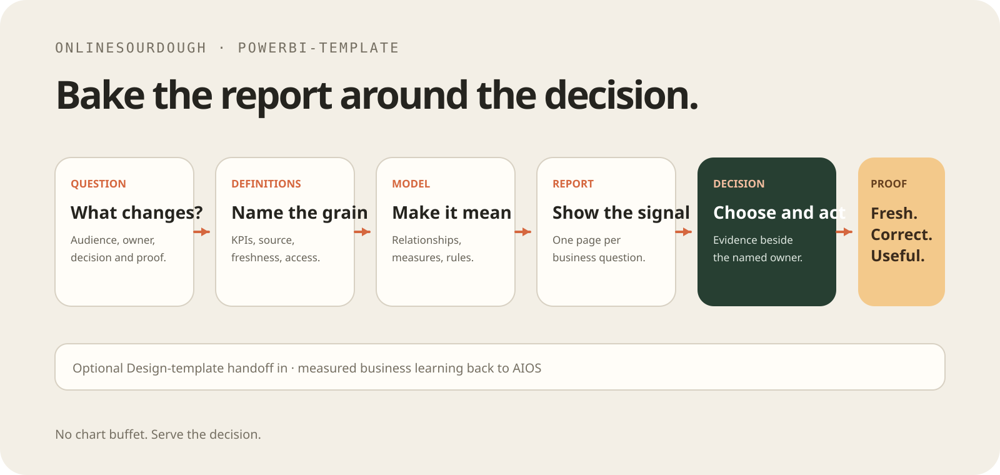

# PowerBI-template

A private foundation for turning a business question into an owned Power BI
model, report, and decision workflow.

```text
business question → definitions and data → model → report → decision → proof
```

Start from AIOS context, a standalone brief, or an approved Design-template
handoff. This repository owns the Power BI solution after the handoff.

## Start

1. Complete [workspace/PROJECT-BRIEF.md](workspace/PROJECT-BRIEF.md).
2. Keep business definitions next to their measure, format, interpretation, and
   limitation.
3. Build the model before the report.
4. Make each report page answer one named business question.
5. Validate before opening, publishing, or claiming completion.

```sh
npm run doctor
npm run validate
npm test
```

## What is included

- Project-local skills for Power BI, PBIP/PBIR/TMDL, DAX, reports, Fabric, and
  validation.
- Short prompts for audit, page planning, and validation.
- A dependency-free PBIP/PBIR/TMDL validator and valid/invalid fixtures.
- An optional Pi extension that exposes doctor and validation commands.

Pi is an adapter, not the primary interface. Any coding-agent harness can use
the repository instructions, skills, prompts, and Node scripts directly.

## Workflow

| Need | Route |
| --- | --- |
| Business question, KPI, and decision | `.agents/skills/powerbi/SKILL.md` |
| PBIP/PBIR/TMDL structure and safe edits | `.agents/skills/pbip/SKILL.md` |
| Measures and semantic logic | `.agents/skills/dax/SKILL.md` |
| Report pages, visuals, layout, and filters | `.agents/skills/report/SKILL.md` |
| Fabric or Power BI Service work | `.agents/skills/fabric/SKILL.md` |
| Completion proof | `.agents/skills/validation/SKILL.md` |

An approved Design-template handoff can supply `DESIGN.md`, report composition,
tokens, and preview intent. Revalidate it against actual Power BI capabilities,
data, accessibility, and tenant constraints; Design-template is not a runtime
dependency.

## Optional Pi adapter

When Pi is useful, install the package project-locally:

```sh
pi install -l git:github.com/onlinesourdough/PowerBI-template
```

It provides `/powerbi-doctor`, `/powerbi-validate`, prompt templates, and edit
warnings. Without Pi, use the same scripts directly.

## Safety

Ask before deleting pages or visuals, rebinding reports, changing `.platform`
IDs, publishing, overwriting service items, or changing refresh and access
policy. Keep tenant IDs, credentials, connection strings, and private data out
of Git and fixtures.

## License

MIT.
