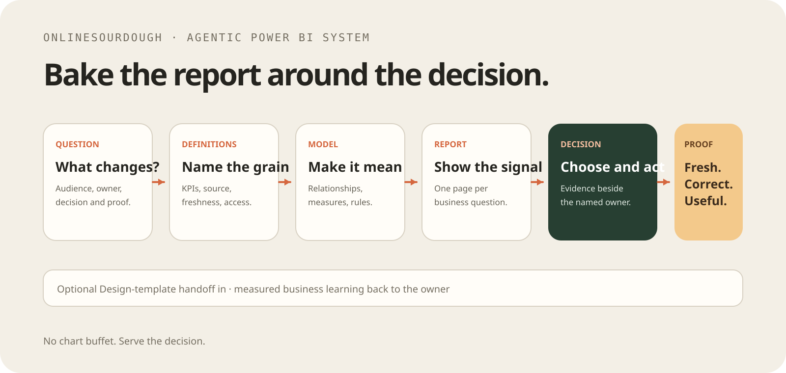

# Agentic Power BI System

A standalone System for turning a business question into an owned, validated
Power BI model, report, and decision workflow with durable proof.

```text
business question → definitions and data → model → report → decision → proof
```

Start from the project brief, resolved business context, or an approved Agentic
Design System handoff. This repository owns the Power BI solution after the
handoff while preserving the decision, data, security, refresh, and publish
boundaries.

## Start

1. Complete [workspace/PROJECT-BRIEF.md](workspace/PROJECT-BRIEF.md).
2. Read the primary route at
   `.agents/skills/agentic-powerbi-system/SKILL.md`.
3. Keep business definitions next to their measure, format, interpretation, and
   limitation.
4. Build the model before the report.
5. Make each report page answer one named business question.
6. Validate before opening, publishing, or claiming completion.

```sh
npm run doctor
npm run validate
npm test
npm run audit -- --scope both
npm pack --dry-run
```

## What is included

- One primary System skill for durable routing and run evidence.
- Specialist skills for Power BI, PBIP/PBIR/TMDL, DAX, reports, Fabric, and
  validation.
- A dependency-free PBIP/PBIR/TMDL validator and valid/invalid fixtures.
- A standard-library tracer for success, failure, recovery, and deliberate
  example promotion.

## Workflow

| Need | Route |
| --- | --- |
| System routing, prior runs, and evidence | `.agents/skills/agentic-powerbi-system/SKILL.md` |
| Business question, KPI, and decision | `.agents/skills/powerbi/SKILL.md` |
| PBIP/PBIR/TMDL structure and safe edits | `.agents/skills/pbip/SKILL.md` |
| Measures and semantic logic | `.agents/skills/dax/SKILL.md` |
| Report pages, visuals, layout, and filters | `.agents/skills/report/SKILL.md` |
| Fabric or Power BI Service work | `.agents/skills/fabric/SKILL.md` |
| Completion proof | `.agents/skills/validation/SKILL.md` |
| Periodic accumulated-state health | `.agents/skills/system-audit/SKILL.md` |

## Distinct assurance routes

- **Deterministic validation** runs mechanical PBIP/PBIR/TMDL and repository
  checks against a named target.
- **Power BI/domain audit** applies the `powerbi` contract to business meaning,
  model design, DAX, shaping risk, report storytelling, and ownership.
- **Semantic or visual review** uses specialist judgment or native tools to
  assess behavior that deterministic checks cannot prove.
- **Per-change Review** is the lifecycle gate for accepting a proposed change.
- **Periodic System audit** reads accumulated repository/workspace health,
  proves its live upstream relation, and returns `PASS`, `FAIL`, or `BLOCKED`
  without repair or durable audit artifacts.

Select the periodic scope explicitly:

```sh
npm run audit -- --scope repository
npm run audit -- --scope workspace
npm run audit -- --scope both
```

The audit uses current repository and workspace truth. It references the
existing domain-audit and validation contracts and does not require another
System implementation.

An approved Agentic Design System handoff can supply `DESIGN.md`, report
composition, tokens, and preview intent. Revalidate it against actual Power BI
capabilities, data, accessibility, and tenant constraints; the handoff is
reference input, not an execution requirement.

## Persistent workspace

```text
workspace/
├── PROJECT-BRIEF.md       decision, KPI, data, and proof contract
├── briefs/                active bounded briefs
├── models/                active semantic-model work
├── reports/               active report work
├── state/                 local System state
├── runs/                  one durable evidence directory per route
├── history/runs.jsonl     append-only relation between runs
├── learning/              durable notes intentionally retained
└── engine/                optional local validators, tracer, and tests
examples/                  deliberately curated standalone proof
docs/                      contract and validation notes
```

The primary route inspects prior records before routing work. It never copies
request transcripts into the ledger. A run is valid without promotion; a
curated example is written only when explicitly requested and includes its own
README and proof file.

## Safety

Ask before deleting pages or visuals, rebinding reports, changing `.platform`
IDs, publishing, overwriting service items, or changing refresh and access
policy. Keep tenant IDs, credentials, connection strings, private data, and
generated local Power BI state out of Git and fixtures.

`npm pack --dry-run` runs a read-only seed guard. It succeeds for blank
placeholders and deliberate curated examples, and refuses to bundle mutable
workspace evidence without deleting or resetting it.

## Deterministic System proof

Run the full local route in a disposable checkout or temporary copy:

```sh
python3 workspace/engine/tracer.py --promote-example
python3 workspace/engine/tracer.py --simulate-failure
python3 workspace/engine/tracer.py --recover --promote-example
```

The fixed demonstration clock makes the first clean run `run-0001`. The failed
run remains in the ledger, and the recovery run points to that predecessor.
The source repository should remain a seed with empty operational placeholders
after validation.

## License

MIT.
